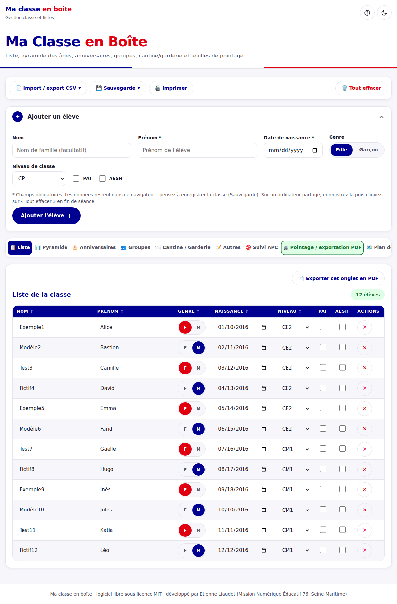
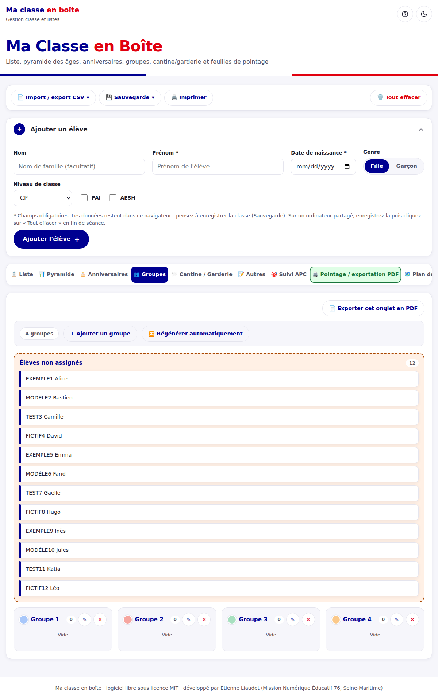
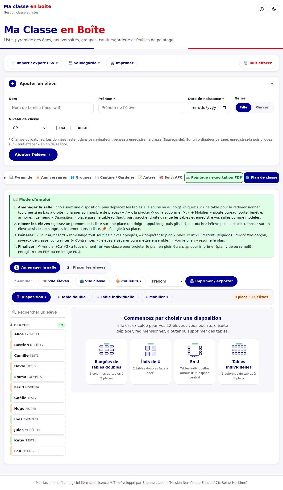

# Ma classe en boîte - Gestion classe et listes

 

## Description

Ma classe en boîte aide les enseignants du premier degré à gérer leur classe : liste des élèves, pyramide des âges, anniversaires, groupes, cantine et garderie, pense-bête, suivi des séances d'APC, feuilles de pointage à imprimer et plan de classe.

Tout se fait dans le navigateur : pas de compte, pas d'installation, pas de serveur. Les données restent sur l'ordinateur de l'utilisateur (stockage local du navigateur) et ne sont jamais envoyées ailleurs.

**Public visé :** enseignants d'école primaire (cycles 2 et 3), toutes disciplines, pour l'organisation quotidienne de la classe.

## Visuels

| Liste des élèves | Groupes | Plan de classe |
|---|---|---|
|  |  |  |

Les captures utilisent des noms fictifs. Démo : la page GitLab Pages du projet, une fois le pipeline exécuté.

## Installation

Prérequis : un navigateur récent (Firefox, Chrome, Edge, Safari). Aucune autre dépendance.

- **En ligne :** ouvrez la page GitLab Pages du projet.
- **Hors ligne :** téléchargez le dépôt (bouton « Code » > « Télécharger »), décompressez-le, puis ouvrez `index.html` dans le navigateur.

## Utilisation

1. Dans l'onglet **Liste**, ajoutez un élève (prénom et date de naissance obligatoires), ou importez un fichier CSV (compatible avec l'export ONDE « Liste simple des élèves par classe »).
2. Utilisez les autres onglets : pyramide des âges, anniversaires, groupes, cantine / garderie, pense-bête, suivi APC, pointage, plan de classe.
3. Cliquez sur **Sauvegarde** pour exporter toute la classe en JSON et la reprendre plus tard, y compris sur un autre appareil.
4. Sur un ordinateur partagé, enregistrez la classe puis cliquez sur **Tout effacer** en fin de séance.

Pour imprimer ou obtenir un PDF, utilisez « Exporter cet onglet en PDF » puis choisissez « Enregistrer au format PDF » dans la fenêtre d'impression.

## Support

Ouvrez un ticket dans le suivi des tickets de la Forge pour signaler un problème ou proposer une idée. Ne joignez jamais de vraies données d'élèves.

## Feuille de route

Idées : davantage de modèles de plans de classe, nouveaux exports. Les propositions sont les bienvenues.

## Contribution

Les contributions sont ouvertes : voir [CONTRIBUTING.md](CONTRIBUTING.md). Le projet n'a pas de dépendance ni d'étape de compilation : pour le lancer en local, ouvrez `index.html` dans un navigateur. Il n'y a pas de tests automatisés ; testez à la main les onglets concernés.

Problème connu : les données sont propres à chaque navigateur et chaque appareil, pensez à la sauvegarde JSON.

## Auteurs et remerciements

- Etienne Liaudet, Mission numérique éducatif 76 (DSDEN de la Seine-Maritime).

Ressources tierces : aucune embarquée. Seule dépendance externe : le logo du cartouche de la Forge, chargé depuis docs.forge.apps.education.fr (l'application fonctionne sans lui). Elle utilise la police système de l'utilisateur et des icônes emoji et SVG intégrées au code.

## Licence

Code publié sous licence [MIT](LICENSE). Le projet ne contient pas de ressource pédagogique à part, donc pas de seconde licence.

## Statut du projet

Actif. Le projet cherche un co-mainteneur pour assurer la continuité : n'hésitez pas à vous manifester via un ticket.
